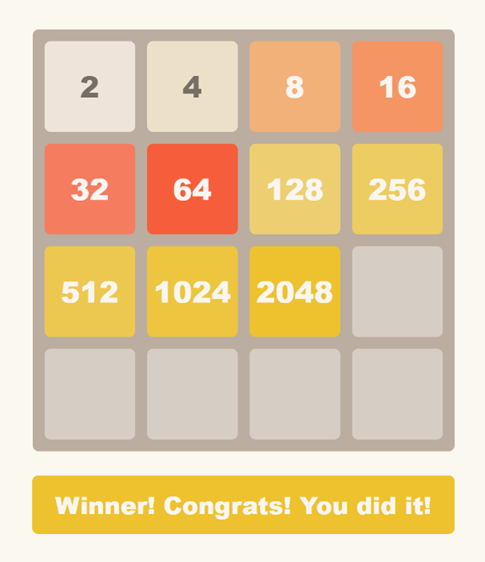

Project Name  
### 🧩 **2048 Game**  - [DEMO LINK](https://JulyaPetrovskaya.github.io/js-2048-game)
&nbsp; _Description_: 

This is a JavaScript implementation of the classic 2048 game. The game features a 4x4 grid where players combine numbered tiles by sliding them with arrow keys, aiming to reach the 2048 tile. It includes core game mechanics such as tile merging, random tile generation, score tracking, and game over/win states. The project showcases skills in JavaScript game logic, event handling, and DOM manipulation.  

#### How to Play:
Use the arrow keys on your keyboard to slide all tiles on the 4x4 board in the chosen direction.
When two tiles with the same number collide, they merge into one tile with their sum.
Each move causes a new tile (2 or 4) to appear in a random empty spot.
Keep sliding and merging tiles to reach the 2048 tile.
The game ends if no moves are possible.
Keep pressing the arrow keys until you see a result like in the picture below:

#### Main Technologies and Frameworks:
- JavaScript (ES6+) — core game logic and event handling
- ESLint — code linting for error checking and maintaining consistent style
- HTML5 — game board markup
- SCSS (Sass) — preprocessor for writing and organizing styles efficiently
- CSS3 — styles for rendering the interface in the browser (compiled from SCSS)
- DOM API — manipulating page elements and updating game state
- Event Listeners — handling key presses for game control
- Node.js — JavaScript runtime environment for development and running the project
- npm — package manager for dependency installation and script management
- Git — version control system
